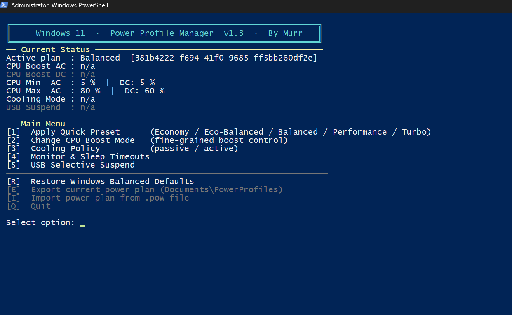

# Power Profile Manager

**Advanced Windows power management with precision control over CPU boost, thermals, and performance.**



## Installation

1. Download `PowerProfile.ps1` and `PowerProfile.bat`
2. Double-click `PowerProfile.bat` to launch with admin rights
3. Select your desired power profile

## Usage

```powershell
# Run directly (requires admin)
.\PowerProfile.ps1

# Or use the launcher
.\PowerProfile.bat
```

Navigate the menu using number keys and letters. All changes are reversible.

## Requirements

- Windows 10 21H2+ or Windows 11
- PowerShell 5.1 or higher
- Administrator privileges

## License

MIT License - Copyright (c) 2026 [Murr](https://github.com/vtstv)
